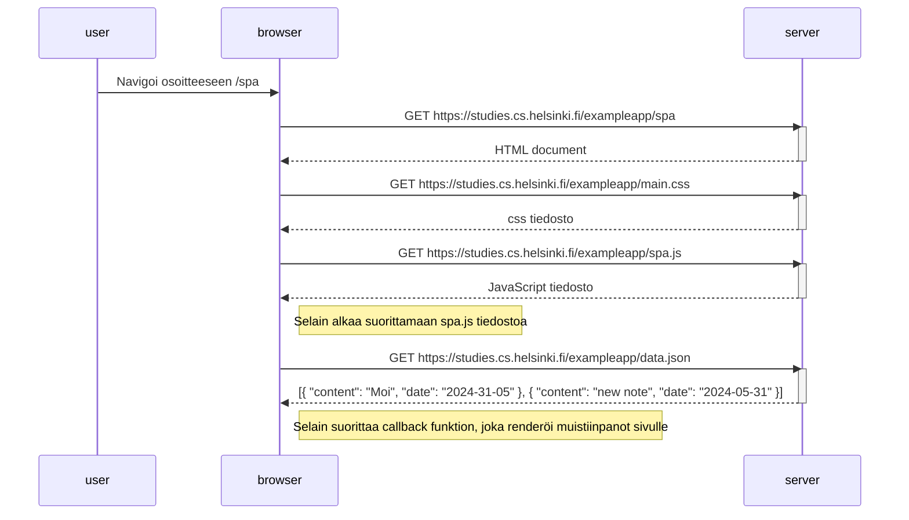

```mermaid
sequenceDiagram
    participant user
    participant browser
    participant server

    user->>browser: Navigoi osoitteeseen /spa

    browser->>server: GET https://studies.cs.helsinki.fi/exampleapp/spa
    activate server
    server-->>browser: HTML document
    deactivate server

    browser->>server: GET https://studies.cs.helsinki.fi/exampleapp/main.css
    activate server
    server-->>browser: css tiedosto
    deactivate server

    browser->>server: GET https://studies.cs.helsinki.fi/exampleapp/spa.js
    activate server
    server-->>browser: JavaScript tiedosto
    deactivate server

    Note right of browser: Selain alkaa suorittamaan spa.js tiedostoa

    browser->>server: GET https://studies.cs.helsinki.fi/exampleapp/data.json
    activate server
    server-->>browser: [{ "content": "Moi", "date": "2024-31-05" }, { "content": "new note", "date": "2024-05-31" }]
    deactivate server

    Note right of browser: Selain suorittaa callback funktion, joka renderöi muistiinpanot sivulle
```
