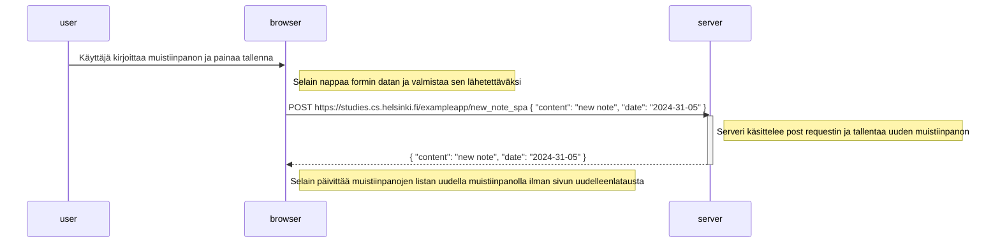

```mermaid
sequenceDiagram
    participant user
    participant browser
    participant server

    user->>browser: Käyttäjä kirjoittaa muistiinpanon ja painaa tallenna

    Note right of browser: Selain nappaa formin datan ja valmistaa sen lähetettäväksi

    browser->>server: POST https://studies.cs.helsinki.fi/exampleapp/new_note_spa { "content": "new note", "date": "2024-31-05" }
    activate server
    Note right of server: Serveri käsittelee post requestin ja tallentaa uuden muistiinpanon

    server-->>browser: { "content": "new note", "date": "2024-31-05" }
    deactivate server

    Note right of browser: Selain päivittää muistiinpanojen listan uudella muistiinpanolla ilman sivun uudelleenlatausta
```